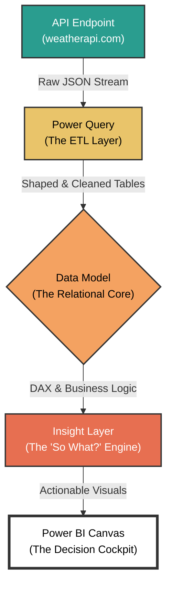

# 🌦️ Project Metis: Beyond the Weather Forecast
### An Analytical Exploration in Transforming Raw Data into Actionable Daily Insights

> **This project is not just a weather dashboard.** It is a functional prototype for a personalized environmental decision support system. It serves as an exercise in product thinking, demonstrating how we can move beyond simply *reporting* data to creating tools that help users make better, more informed daily decisions.

---

## 🚀 Final Product: The Decision Cockpit
This is the tangible output of the strategic process outlined below. It's designed for clarity, scannability, and immediate insight, enabling a user to make a quick, informed decision in seconds.

---

## ⚙️ Visualization: The Insight Engine Framework
This diagram illustrates the project's architecture as a "Minimum Viable Insight (MVI)" Engine. It shows the journey from raw, unstructured data to a strategic, human-centric output.

### 1. The Core Problem: From Data Noise to Decision Clarity
The problem isn't a lack of weather data; it's a lack of **decision-ready** information. A user's core questions are rarely "What is the PM2.5 value?" They are:

> 🤔 *"Is it healthy for me to go for a run right now?"*
>
> 🗓️ *"Should I plan my picnic for Saturday or Sunday?"*
>
> ⏰ *"Do I need to leave for my meeting 10 minutes early because of potential rain?"*

Conventional weather apps present data points. This project's hypothesis is that a product's true value lies in translating those data points into direct answers.

### 2. A Product-Led Approach: Embracing the "Sorting Problem"
During development, a challenge arose: the 7-day forecast sorted day names alphabetically (*"Friday", "Monday", "Saturday"*) instead of chronologically.

- **A conventional view** sees this as a bug to be fixed.
- **My product-led view** saw it as a critical insight into the user's mental model. A user doesn't think in "alphabetical days"; they think in a linear timeline. This "bug" wasn't a technical flaw; it was a **UX disconnect**.

The solution—creating a `DayOfWeekSort` column—wasn't just a technical fix. It was a strategic decision to enforce a user-centric data model over the machine's default logic.

### 3. Analytical Decision Frameworks
Every component was a product decision informed by a specific analytical framework:

| Feature/Component         | Analytical Framework Applied            | Rationale & Outcome                                                                                                                                                             |
| ------------------------- | --------------------------------------- | ------------------------------------------------------------------------------------------------------------------------------------------------------------------------------- |
| **Air Quality Index Gauge** | `Data-to-Insight Translation Model`     | A raw number like "66" is meaningless. By using a DAX `SWITCH` statement, I translated it into a color (Yellow) and a clear suggestion ("Acceptable air quality, stay active"). |
| **City Selection Toggles** | `Jobs-to-be-Done (JTBD)`                | The user's "job" is to check weather for relevant locations. Simple toggles provide this utility with minimal friction, directly serving the user's need.                       |
| **7-Day Forecast Chart** | `Trend vs. Point-in-Time Analysis`      | A user needs to see the *narrative* of the week's weather. A line chart was chosen over static cards to emphasize the trend and help with multi-day planning.                 |

### 4. Strategic Futures: Potential Pivots & Iterations
This Minimum Viable Insight (MVI) is a launchpad. Based on potential user feedback, here are three strategic pivots:

- **The Hyper-Personalization Pivot:** Integrate with user calendars and health apps.
- **The B2B Commercial Pivot:** Repackage the backend as a "Small Business Environmental Intelligence API."
- **The Community & Social Pivot:** Add a layer for user-reported, real-time data.

### 5. My Product Philosophy
This project solidified my core product management philosophy: **Data Narrates, Insight Directs, Empathy Decides.**

- **Data Narrates:** The raw API stream told a story of atmospheric conditions.
- **Insight Directs:** Transforming the data into a sorted forecast gave the story a clear direction.
- **Empathy Decides:** Understanding that a user wants a quick answer determined the final, clean, and scannable layout.

### 6. Measuring Success: Quantifiable Impact
Even for a personal project, defining success is critical. If this were a real product, these would be my North Star Metrics:

- **North Star Metric:** Daily Active Decisions (DAD)
- **Primary Metrics:**
  - **Time to Insight (TTI):** `Current TTI is < 3 seconds`.
  - **Data-to-Action Ratio:** What percentage of sessions result in a user making a plan?
  - **Retention:** How many users return the next day?

### 7. A Forward-Looking Vision
The future of data products is not about bigger dashboards. It's about **ambient, predictive, and personalized insight.** My vision for Project Metis is to evolve it into an "environmental concierge" that proactively helps users navigate their day.

---
*This README was crafted by **Anushka Trivedi** as an expression of her product management philosophy and analytical approach.*
